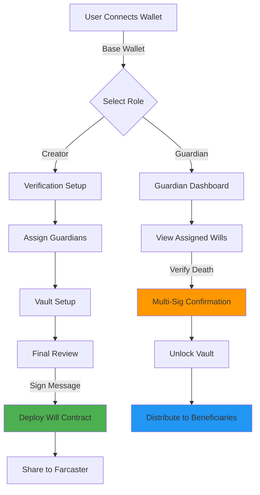

# Neorypto / Necrypto

> Digital inheritance for the crypto era — secure your assets, protect your legacy.

A Base / Farcaster mini-app for digital inheritance, built for the [Aleph Hackathon](https://aleph.im/) (August 2025) by [Kevin Anrique](https://github.com/kevan1).

## Problem

When crypto holders pass away, their digital assets are often lost forever. Private keys die with their owners, leaving grieving families unable to access significant wealth. Traditional inheritance systems don't work for decentralized assets.

## Solution

Neorypto enables crypto holders to:
- Assign trusted **guardians** who can verify their passing via multi-signature
- Lock digital assets in a **secure vault** that releases only after verification
- Configure **death verification methods** (guardian consensus, activity heartbeat, gov registry)
- Distribute assets to beneficiaries automatically through immutable smart contracts

## Status: Hackathon Prototype

This is a **UI/UX prototype** built during a hackathon to demonstrate the concept. It showcases the full user flow but does not deploy real smart contracts or move real funds.

### What's Implemented ✅

- **Wallet Connection**: Base wallet integration via OnchainKit
- **Role Selection**: Creator (will setup) vs Guardian (verification) flows
- **Multi-Step Will Creation**:
  - Verification setup (guardian/heartbeat/gov registry options)
  - Guardian assignment (add/remove wallet addresses)
  - Vault setup with asset deposits (reads real ETH balance, mocked deposits)
  - Final review with deployment confirmation
- **Guardian Interface**: Verification dashboard for assigned guardians
- **Matrix Rain Landing**: Animated cyberpunk-style entry screen
- **Responsive Design**: Mobile-first UI with dark theme

### What's Mocked 🚧

- **Smart Contract Deployment**: Will deployment is simulated (generates mock contract address, no real on-chain tx)
- **Asset Deposits**: Vault deposits are client-side only (no real token transfers)
- **Guardian Verification**: Death verification is a simulated blockchain call (3-second timeout)
- **Beneficiary Management**: Simplified to "assets distributed to guardians"
- **USDC Balance**: Hardcoded mock value
- **Social Sharing**: Uses `composeCast` API but won't post without full Farcaster integration

## Architecture Flow



## Tech Stack

- **Framework**: [Next.js 15](https://nextjs.org/) (App Router)
- **Blockchain**: [Base](https://base.org/) (Coinbase L2)
- **Wallet/Identity**: [OnchainKit](https://docs.base.org/builderkits/onchainkit) (Coinbase SDK)
- **Mini-App SDK**: [MiniKit](https://docs.base.org/builderkits/minikit) + [Farcaster Frame SDK](https://docs.farcaster.xyz/reference/frames/spec)
- **Styling**: [Tailwind CSS](https://tailwindcss.com/) + [Radix UI](https://www.radix-ui.com/)
- **State Management**: React hooks + Wagmi
- **Notifications**: [Upstash Redis](https://upstash.com/) (webhook storage, optional)
- **Animations**: [Framer Motion](https://www.framer.com/motion/)
- **TypeScript**: Strict type checking

## Local Setup

### Prerequisites

- Node.js 18+
- npm, yarn, pnpm, or bun
- A Coinbase Wallet (for testing)

### Installation

```bash
# Clone the repository
git clone https://github.com/kevan1/Necrypto-AlephHackathon.git
cd Necrypto-AlephHackathon

# Install dependencies
npm install

# Copy environment template
cp .env.example .env.local
```

### Environment Variables

See `.env.example` for all required variables. Key ones:

```bash
# OnchainKit (required for wallet connection)
NEXT_PUBLIC_ONCHAINKIT_API_KEY=your_api_key

# App Metadata (Frame configuration)
NEXT_PUBLIC_URL=http://localhost:3000
NEXT_PUBLIC_ONCHAINKIT_PROJECT_NAME="Neorypto"

# Redis (optional, for notifications)
REDIS_URL=your_redis_url
REDIS_TOKEN=your_redis_token
```

**Note**: The app will run without Redis (notifications disabled). OnchainKit API key is recommended but not strictly required for local development.

### Run Development Server

```bash
npm run dev
```

Open [http://localhost:3000](http://localhost:3000) and connect your Base wallet.

### Build for Production

```bash
npm run build
npm start
```

## Project Structure

```
necrypto/
├── app/
│   ├── components/
│   │   ├── RoleSelection.tsx       # Choose Creator vs Guardian
│   │   ├── VerificationSetup.tsx   # Step 1: Configure verification
│   │   ├── AssignGuardians.tsx     # Step 2: Add guardian wallets
│   │   ├── VaultSetup.tsx          # Step 3: Deposit assets
│   │   ├── FinalReview.tsx         # Step 4: Review & deploy
│   │   ├── GuardianInterface.tsx   # Guardian verification UI
│   │   └── DemoComponents.tsx      # Shared UI primitives
│   ├── api/
│   │   ├── notify/                 # Farcaster notifications
│   │   └── webhook/                # Webhook handler
│   ├── page.tsx                    # Main app entry
│   ├── layout.tsx                  # Root layout + Frame metadata
│   └── providers.tsx               # MiniKit + Wagmi setup
├── components/
│   ├── matrix-rain.tsx             # Animated landing screen
│   └── ui/                         # Radix UI components
├── lib/
│   ├── notification.ts             # Upstash Redis client
│   └── notification-client.ts      # Frame notification helpers
└── public/
    └── ascii-art-text.png          # Logo
```

## Next Steps

To turn this into a production-ready app:

### Core Smart Contracts
- [ ] Implement will creation contract (ERC-4337 account abstraction)
- [ ] Multi-sig guardian verification logic
- [ ] Time-locked asset release mechanism
- [ ] Beneficiary distribution rules engine

### Asset Management
- [ ] Real ERC-20 token deposits (USDC, DAI, etc.)
- [ ] NFT inheritance support (ERC-721/ERC-1155)
- [ ] Multi-chain vault (Base, Ethereum mainnet, Arbitrum)
- [ ] Gas fee estimation and prepayment

### Death Verification
- [ ] Guardian consensus threshold (e.g., 2-of-3 signatures)
- [ ] Activity heartbeat contract (check-in or auto-trigger)
- [ ] Government death registry oracle integration
- [ ] Challenge period for false claims

### Security & Legal
- [ ] Smart contract audit (OpenZeppelin, Trail of Bits)
- [ ] Legal framework compliance (state-specific inheritance laws)
- [ ] Emergency recovery mechanism
- [ ] Encrypted backup of guardian contacts

### UX Improvements
- [ ] Beneficiary management (addresses + percentages)
- [ ] Email/SMS notifications to guardians
- [ ] Will update mechanism (before death)
- [ ] Testnet deployment for safe testing

## Demo Video

[Coming soon - add screen recording link]

## Hackathon Context

Built for **Aleph Hackathon** (August 2025) in the Digital Inheritance / Web3 Legacy track. The project explores how blockchain can solve the "dead man's switch" problem for crypto holders while maintaining security and preventing premature unlocking.

## License

MIT License - See [LICENSE](LICENSE) for details.

## Acknowledgments

- [Base](https://base.org/) for the MiniKit template and OnchainKit
- [Farcaster](https://www.farcaster.xyz/) for the Frame SDK and social layer
- [Coinbase](https://www.coinbase.com/) for wallet infrastructure
- [Aleph.im](https://aleph.im/) for hosting the hackathon

---

**Built with ❤️ on Base** | [GitHub](https://github.com/kevan1/Necrypto-AlephHackathon)
